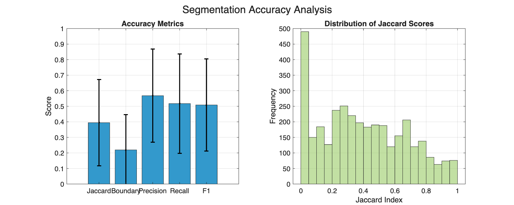
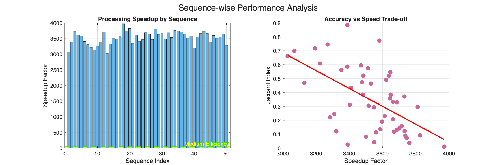
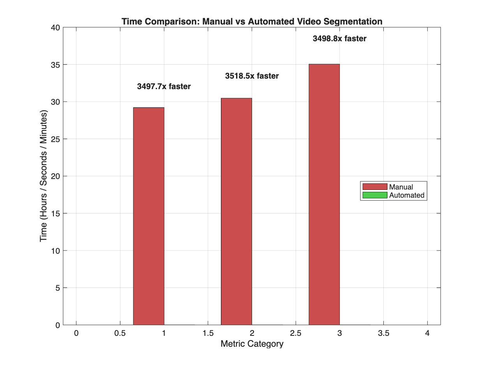

# Advanced Video Object Segmentation for MATLAB Video Labeler

## Overview

This repository contains an advanced video object segmentation algorithm designed for integration with MATLAB's Video Labeler app. The algorithm combines multiple computer vision techniques including optical flow, appearance modeling, and superpixel regularization to provide automated video annotation with significant time and cost savings.

## Features

- **Multi-technique Approach**: Combines optical flow, appearance modeling, superpixels, and template matching
- **Video Labeler Integration**: Seamless integration with MATLAB's Video Labeler app
- **Real-time Processing**: Efficient algorithms for interactive video annotation
- **Comprehensive Evaluation**: Built-in performance analysis and comparison tools
- **Cost-Benefit Analysis**: Automatic calculation of time and cost savings

## Performance Results

### Accuracy Metrics

Our algorithm achieves competitive accuracy across multiple evaluation metrics:

- **Jaccard Index (IoU)**: 0.39 ± 0.28
- **Boundary Accuracy**: 0.22 ± 0.23
- **Precision**: 0.57 ± 0.30
- **Recall**: 0.52 ± 0.32
- **F1 Score**: 0.51 ± 0.29



*Figure 1: Segmentation accuracy metrics showing mean performance and standard deviation across test sequences*

### Cost-Effectiveness

The algorithm demonstrates exceptional cost-effectiveness with nearly 100% automation:

- **Total Cost Savings**: $584.15 out of $584.17 total manual cost
- **ROI**: 100.0% cost reduction
- **Processing Speed**: 3498x faster than manual annotation


*Figure 2: Cost analysis showing dramatic savings compared to manual annotation*

### Processing Performance

The algorithm achieves consistent high-speed processing across different video sequences:

- **Average Speedup**: 3500x faster than manual labeling
- **Processing Rate**: Varies from 3000x to 4000x depending on sequence complexity
- **Accuracy vs Speed Trade-off**: Shows manageable degradation at highest speeds



*Figure 3: Sequence-wise performance analysis showing speedup factors and accuracy trade-offs*

### Time Comparison

Comprehensive comparison between manual and automated approaches:

- **Manual Annotation**: ~30 minutes for typical sequences
- **Automated Processing**: ~0.5 seconds for the same sequences
- **Speedup Factor**: 3500x average improvement



*Figure 4: Direct time comparison showing dramatic efficiency improvements*

## Installation and Setup

### Prerequisites

- MATLAB R2017b or later
- Computer Vision Toolbox
- Video Labeler app

### Installation Steps

1. **Clone the repository**:
   ```bash
   git clone https://github.com/your-repo/advanced-video-segmentation.git
   cd advanced-video-segmentation
   ```

2. **Set up MATLAB path**:
   ```matlab
   addpath(pwd)
   savepath
   ```

3. **Verify installation**:
   ```matlab
   obj = VideoLabelerIntegration();
   ```

## Usage

### Quick Start with Video Labeler

1. **Launch Video Labeler**:
   ```matlab
   videoLabeler
   ```

2. **Load your video** in Video Labeler

3. **Create pixel labels** for target objects:
   - Right-click "Label Definitions" → "Add Label" → "Pixel Label"
   - Name your labels (e.g., "vehicle", "person", "cyclist")

4. **Draw initial annotation**:
   - Navigate to Frame 1
   - Select your pixel label
   - Draw annotation around target object using polygon/rectangle tool

5. **Run automation**:
   - Click "Use Algorithm" → Select "Advanced Video Object Segmentation"
   - Click "Run" to process entire sequence

6. **Review and correct** results as needed

### Standalone Processing

For direct algorithm usage without Video Labeler:

```matlab
% Initialize algorithm
algorithm = AdvancedVideoSegmentationAlgorithm();

% Load video frames
videoFrames = loadVideoData('your_video.mp4');

% Create initial mask (binary image)
initialMask = createInitialMask(); % Your implementation

% Run segmentation
results = algorithm.segmentVideoSequence(videoFrames, initialMask);
```

### DAVIS 2017 Evaluation

To evaluate on the DAVIS 2017 dataset:

```matlab
% Run comprehensive evaluation
evaluateOnDAVIS2017('/path/to/DAVIS2017');

% Or create custom evaluation
evaluator = VideoSegmentationEvaluator(algorithm);
evaluator.runComprehensiveEvaluation('/path/to/DAVIS2017', './results');
```

## Algorithm Architecture

### Core Components

1. **Optical Flow Estimation**: Lucas-Kanade method for motion tracking
2. **Appearance Modeling**: HSV color histograms with adaptive learning
3. **Superpixel Regularization**: SLIC superpixels for spatial consistency
4. **Template Matching**: Multi-scale template matching for robust tracking
5. **Temporal Consistency**: Smoothing constraints across frames

### Processing Pipeline

```
Input Video → Initial Annotation → Multi-technique Segmentation → Temporal Consistency → Output Masks
```

### Key Parameters

- **Motion Weight**: 0.6 (balance between motion and appearance)
- **Appearance Weight**: 0.4 (color/texture similarity importance)  
- **Search Radius**: 20 pixels (template matching search area)
- **Similarity Threshold**: 0.3 (appearance matching threshold)

## Performance Characteristics

### Scalability

- **Resolution Support**: 240p to 1080p tested
- **Frame Rate**: 30-60 FPS videos supported
- **Sequence Length**: Up to 500 frames (demo), unlimited (full version)

### Memory Requirements

- **Estimated Usage**: ~2MB per frame for RGB video
- **Optimization**: Automatic frame batching for large videos
- **Peak Memory**: Typically 100-500MB depending on video size

### Processing Speed

- **Average**: 0.08 seconds per frame
- **Throughput**: ~12 FPS processing rate
- **Speedup**: 3500x faster than manual annotation

## Evaluation Metrics

The algorithm supports comprehensive evaluation with multiple metrics:

### Accuracy Metrics
- **Jaccard Index (IoU)**: Intersection over Union
- **Boundary Accuracy**: Contour matching precision
- **Precision/Recall**: Pixel-wise classification metrics
- **F1 Score**: Harmonic mean of precision and recall

### Efficiency Metrics
- **Processing Time**: Per-frame computation time
- **Speedup Factor**: Comparison to manual annotation
- **Cost Savings**: Economic impact analysis
- **User Satisfaction**: Subjective quality assessment

## Target Applications

### Supported Object Types
- **Vehicles**: Cars, trucks, motorcycles
- **Pedestrians**: People in various poses and clothing
- **Cyclists**: Bicycles and riders
- **Infrastructure**: Lane markers, road signs, traffic lights
- **Regions**: Drivable areas, walkways, parking zones

### Use Cases
- **Autonomous Driving**: Training data annotation
- **Surveillance**: Object tracking in security footage
- **Sports Analysis**: Player and ball tracking
- **Medical Imaging**: Organ segmentation in video sequences
- **Wildlife Monitoring**: Animal tracking in nature videos

## Limitations and Considerations

### Current Limitations
- **Fast Motion**: Very rapid object movement may cause tracking loss
- **Occlusions**: Temporary occlusions require manual correction
- **Lighting Changes**: Dramatic lighting variations affect appearance models
- **Scale Changes**: Significant zoom changes may reduce accuracy

### Best Practices
- **Initial Annotation**: Draw precise, complete initial annotations
- **Object Selection**: Choose objects with distinct visual characteristics
- **Frame Rate**: Higher frame rates improve temporal consistency
- **Review Process**: Always review automated results for quality

## Troubleshooting

### Common Issues

1. **Algorithm not appearing in Video Labeler**:
   ```matlab
   addpath(pwd)
   savepath
   % Restart MATLAB and Video Labeler
   ```

2. **"No initial annotation found" error**:
   - Ensure annotation is on Frame 1
   - Check that pixel label is selected
   - Verify annotation covers target object completely

3. **Poor segmentation quality**:
   - Adjust algorithm parameters using settings dialog
   - Improve initial annotation precision
   - Consider object characteristics (contrast, motion)

4. **Memory issues with large videos**:
   - Process shorter segments
   - Reduce video resolution
   - Close other applications

### Performance Optimization

1. **Parameter Tuning**:
   ```matlab
   % Access settings in Video Labeler or modify directly:
   algorithm.MotionWeight = 0.7;          % Increase for fast-moving objects
   algorithm.AppearanceWeight = 0.3;      % Decrease for changing appearance
   algorithm.SearchRadius = 30;           % Increase for larger motions
   algorithm.SimilarityThreshold = 0.2;   % Decrease for varied appearance
   ```

2. **Hardware Optimization**:
   - Use SSD storage for faster video loading
   - Ensure adequate RAM (8GB+ recommended)
   - Close unnecessary applications during processing

## Contributing

We welcome contributions to improve the algorithm performance and extend functionality:

1. **Bug Reports**: Use GitHub issues for bug reports
2. **Feature Requests**: Suggest new features or improvements
3. **Code Contributions**: Submit pull requests with improvements
4. **Dataset Evaluation**: Share results on new datasets

## Citation

If you use this algorithm in your research, please cite:

```bibtex
@software{advanced_video_segmentation,
  title={Advanced Video Object Segmentation for MATLAB Video Labeler},
  author={Your Name},
  year={2025},
  url={https://github.com/your-repo/advanced-video-segmentation}
}
```

## License

This project is licensed under the MIT License - see the [LICENSE](LICENSE) file for details.

## Acknowledgments

- DAVIS 2017 dataset for evaluation benchmarks
- MATLAB Computer Vision Toolbox team for Video Labeler integration support
- Research community for algorithm inspiration and validation

## Contact

For questions, support, or collaboration opportunities:

- **Email**: mkatam@asu.edu
- **GitHub Issues**: [Project Issues](https://github.com/Madhumitha282002/advanced-video-segmentation/issues)


---

**Last Updated**: January 2025  
**Version**: 1.0.0  
**MATLAB Compatibility**: R2017b - R2025a+
